<div align="center">
  

  <h3>Earn Your Break</h3>

  <p>
    <strong>ScrollOff</strong> is an iOS app designed to help you break free from endless scrolling and reclaim your most valuable resource: time.
  </p>

  [](https://www.apple.com/ios/)
  [](https://swift.org)
  [](https://developer.apple.com/xcode/swiftui/)
  [](LICENSE)
</div>

---

## Features

### Core Features

- **🎯 Earn Your Peek**: Earn time credits by staying away from blocked apps, then spend them when you need access
- **🔒 Smart App Blocking**: Block unlimited apps (Premium/Pro) with intelligent cooldown periods
- **🌙 No-Go Zone**: Schedule ultra-strict blocking periods for maximum focus (e.g., midnight to 8 AM)
- **💪 Focus Challenge**: Set timed focus sessions (1-12 hours) and earn bonus credits
- **📊 Usage Insights**: Track patterns with 7-day (Premium) or 30-day (Pro) analytics
- **🎟️ Emergency Tokens**: Purchase temporary access when you truly need it
- **🔐 Biometric Protection**: Lock settings behind Face ID/Touch ID (Pro)
- **💼 Per-App Wallets**: Separate credit balances for each blocked app (Pro)
- **🌐 Custom Domains**: Block distracting websites in Safari (Premium/Pro)
- **🌓 Dark Mode**: Full support for light and dark appearances

### Privacy First

**100% privacy-focused**: All data stays on your device. No tracking, no servers, no analytics. See our [Privacy Policy](./PRIVACY.md).

## How to Use the App

### Getting Started

1. **First Launch**: When you first open ScrollOff, you'll be guided through a simple onboarding process
2. **Grant Permissions**: Allow Screen Time permissions to enable app monitoring
3. **Set Your Goals**: Configure which apps you want to limit and set daily usage goals
4. **Start Focusing**: Begin a focus session and watch your productivity soar

### Daily Usage

- **Dashboard**: View your daily stats, earned credits, and quick access to focus sessions
- **Focus Timer**: Start a focus session to block distracting apps for a set duration
- **Insights**: Track your progress over time with detailed analytics
- **Settings**: Customize blocked apps, focus durations, and notification preferences

### Features Breakdown

#### Focus Sessions
Start focused work sessions where distracting apps are blocked. Choose from preset durations or create custom timers.

#### Mindfulness Exercises
Take breaks with guided mindfulness exercises designed to refresh your mind and improve concentration.

#### Usage Insights
See detailed breakdowns of your screen time, including:
- Daily and weekly usage patterns
- Most used apps
- Focus session history
- Productivity scores

#### Rewards & Credits
Earn credits by staying away from blocked apps (5 minutes earned per hour of staying focused). Spend earned credits to peek at blocked apps when you need them. Credits roll over for 3-7 days depending on your tier.

## Subscription Tiers

### Free - $0
- Block up to 3 apps
- 1-minute peeks
- 45 minutes daily earning cap
- Same-day credits only (no rollover)

### Premium - $4.99/month
- **Unlimited app blocking**
- 2-minute peeks
- 90 minutes daily earning cap
- 3-day credit rollover
- 7-day usage insights
- Custom domain blocking

### Pro - $8.99/month or $71.99/year
- **14-day free trial**
- All Premium features
- 5-minute peeks
- 120 minutes daily earning cap
- 7-day credit rollover
- 30-day usage insights
- Per-app wallets
- Biometric protection
- 3 free emergency tokens per month

[Download on the App Store](https://apps.apple.com/app/scrolloff/id6738455506) _(Coming Soon)_

## Requirements

- iOS 17.0 or later
- iPhone or iPad
- Screen Time permissions

## Installation

### From Source

1. Clone the repository:
```bash
git clone https://github.com/sugrowth/ScrollOff-iOS-Public.git
cd ScrollOff-iOS-Public
```

2. Open the project in Xcode:
```bash
open ScrollOffApp.xcodeproj
```

3. Select your target device or simulator

4. Build and run the project (⌘R)

### Dependencies

This project uses Swift Package Manager for dependency management. Dependencies will be automatically resolved when you open the project in Xcode.

## Architecture

ScrollOff is built with modern iOS development practices:

- **SwiftUI**: Declarative UI framework for all views
- **Swift Package Manager**: Modular architecture with separate packages for:
  - `EarnEngine`: Rewards and credit system
  - `InsightsEngine`: Analytics and data visualization
  - `BehaviorScience`: Mindfulness and focus features
  - `BlockingEngine`: App blocking functionality
- **Combine**: Reactive programming for state management
- **ScreenTime API**: Native iOS screen time monitoring

## About

### Developer

**Karan Garg**
Creator and Lead Developer

### Team

**Sugrowth**
Building tools for personal growth and productivity

### Mission

We believe that technology should enhance our lives, not consume them. ScrollOff was created to help people develop healthier relationships with their devices and reclaim time for what truly matters.

## Contact & Support

- **Email**: [sugrowth+scrolloff.ios@gmail.com](mailto:sugrowth+scrolloff.ios@gmail.com)
- **GitHub**: [@sugrowth](https://github.com/sugrowth)
- **Issues**: [Report a bug or request a feature](https://github.com/sugrowth/ScrollOff-iOS-Public/issues)

## License

Copyright © 2025 Sugrowth. All rights reserved.

This software and its content are protected by copyright law. Unauthorized reproduction or distribution of this software, or any portion of it, may result in severe civil and criminal penalties.

---

<div align="center">
  <p>Built with ❤️ and SwiftUI by the Sugrowth team</p>
  <p><em>ScrollOff: Earn Your Break</em></p>
</div>
